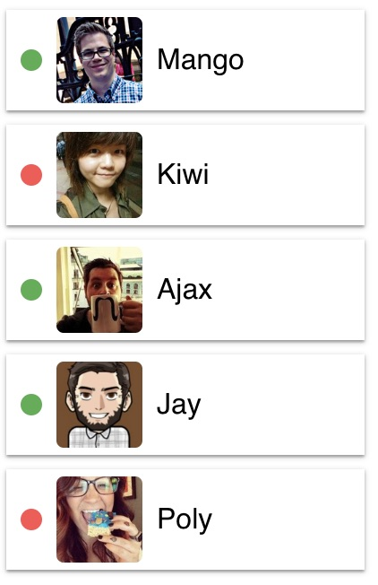

### Task 1 - Social network profile

### Social network profile

We need to develop a `<Profile>` component that allows us to showcase
information about a user on a social network. The user data is stored in the
[`user.json`](https://minhaskamal.github.io/DownGit/#/home?url=https:%2F%2Fgithub.com%2Fgoitacademy%2Freact-homework%2Fblob%2Fmaster%2Fhomework-01%2Fsocial-profile%2Fuser.json)
file.


##### Description of the `<Profile>` component

The component should accept several props with information about the user:

- `username` — username
- `tag` — a tag in a social network without @
- `location` — city and country
- `avatar` — a link to an image
- `stats` — an object with information about activities

The component must create a DOM element of the following structure.

```html
<div class="profile">
  <div class="description">
    
    <p class="name">Petra Marica</p>
    <p class="tag">@pmarica</p>
    <p class="location">Salvador, Brasil</p>
  </div>

  <ul class="stats">
    <li>
      <span class="label">Followers</span>
      <span class="quantity">1000</span>
    </li>
    <li>
      <span class="label">Views</span>
      <span class="quantity">2000</span>
    </li>
    <li>
      <span class="label">Likes</span>
      <span class="quantity">3000</span>
    </li>
  </ul>
</div>
```

##### Example of use

```js
import user from 'path/to/user.json;

<Profile
  username={user.username}
  tag={user.tag}
  location={user.location}
  avatar={user.avatar}
  stats={user.stats}
/>
```

### Task 2 - Statistics section

### Statistics section

Create a `<Statistics>` component to display statistics based on the passed
props. For instance, showcase cloud uploads categorized by file type, website
visits sorted by users in various countries, financial costs, etc. The
statistical data is stored in the
[`data.json`](https://minhaskamal.github.io/DownGit/#/home?url=https:%2F%2Fgithub.com%2Fgoitacademy%2Freact-homework%2Fblob%2Fmaster%2Fhomework-01%2Fstatistics%2Fdata.json)
file.

##### Description of the `<Statistics>` component

The component must accept two props `title` and `stats`, which specify the title
and the statistics object.

- `title` is optional, and if not passed, no `<h2>` title markup should be
  rendered.
- `stats` – an array of objects containing information about the statistics
  element. Can have any number of elements.
- The background color of the statistic element in the design can be omitted or
  a function can be created to generate a random color.

The component must create a DOM element of the following structure.

```html
<section class="statistics">
  <h2 class="title">Upload stats</h2>

  <ul class="stat-list">
    <li class="item">
      <span class="label">.docx</span>
      <span class="percentage">4%</span>
    </li>
    <li class="item">
      <span class="label">.mp3</span>
      <span class="percentage">14%</span>
    </li>
    <li class="item">
      <span class="label">.pdf</span>
      <span class="percentage">41%</span>
    </li>
    <li class="item">
      <span class="label">.mp4</span>
      <span class="percentage">12%</span>
    </li>
  </ul>
</section>
```

##### Example of use

```js
import data from '/path/to/data.json';

<Statistics title="Upload stats" stats={data} />
<Statistics stats={data} />

```

### Task 3 - Friends list

### Friends list

We need to create a `<FriendList>` component with which we can display
information about the user's friends. Information about friends is stored in the
[`friends.json`](https://minhaskamal.github.io/DownGit/#/home?url=https:%2F%2Fgithub.com%2Fgoitacademy%2Freact-homework%2Fblob%2Fmaster%2Fhomework-01%2Ffriend-list%2Ffriends.json)
file.



##### Description of the `<FriendList>` component

The component must accept one `friends` prop – an array of friends objects.

The component should create a DOM of the following structure.

```html
<ul class="friend-list">
  <!-- Arbitrary quantity FriendListItem -->
</ul>
```

##### Description of the `<FriendListItem>` component

The component must accept several props:

- `avatar` - link to the avatar
- `name` - friend's name
- `isOnline` - a boolean indicating the state of a friend: online or not.

Depending on the `isOnline` prop, the background color of `span.status` should
change. This can be done using various CSS classes or Styled Components.

The component should create a DOM of the following structure.

```html
<li class="item">
  <span class="status"></span>
  
  <p class="name"></p>
</li>
```

##### Example of use

```js
import friends from 'path/to/friends.json';

<FriendList friends={friends} />;
```

### Task 4 - Transaction history

### Transaction history

It is necessary to create a transaction history component in the personal
account of the Internet bank.


The data for the list is available in JSON format in the
[`transactions.json`](https://minhaskamal.github.io/DownGit/#/home?url=https:%2F%2Fgithub.com%2Fgoitacademy%2Freact-homework%2Fblob%2Fmaster%2Fhomework-01%2Ftransaction-history%2Ftransactions.json)
file. This is an array of objects, where each object describes one transaction
with the following properties:

- `id` is the unique identifier of the transaction
- `type` — transaction type
- `amount` - transaction amount
- `currency` - type of currency

##### Description of the <TransactionHistory> component

It is necessary to create a `<TransactionHistory>` component that accepts one
prop `items` – an array of transaction objects from transactions.json. The
component creates table markup. Each transaction is a table row. The example
shows the markup of two transactions.

```html
<table class="transaction-history">
  <thead>
    <tr>
      <th>Type</th>
      <th>Amount</th>
      <th>Currency</th>
    </tr>
  </thead>

  <tbody>
    <tr>
      <td>Invoice</td>
      <td>125</td>
      <td>USD</td>
    </tr>
    <tr>
      <td>Withdrawal</td>
      <td>85</td>
      <td>USD</td>
    </tr>
  </tbody>
</table>
```

##### Example of use

```js
import transactions from 'path/to/transactions.json';

<TransactionHistory items={transactions} />;
```
